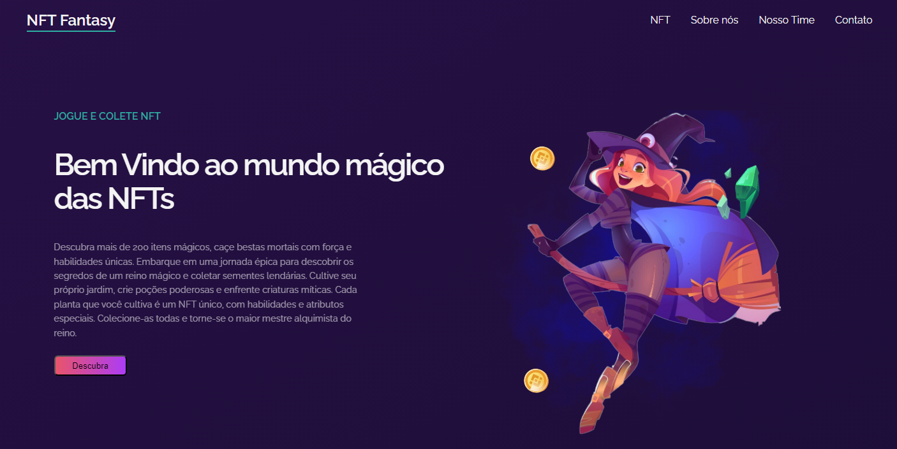

# NFT Fantasy - Projeto de Website

Este projeto consiste no desenvolvimento de um site responsivo chamado **NFT Fantasy**, focado em práticas de desenvolvimento front-end modernas, como a utilização de **Flexbox**, HTML semântico, a convenção **BEM (Block, Element, Modifier)**, além de bibliotecas como **jQuery** e **AOS** para efeitos e carregamento dinâmico.

## Estrutura do Projeto

Este projeto foi desenvolvido utilizando as seguintes tecnologias e boas práticas:

### Tecnologias

- **HTML5**: Para a estrutura semântica da página.
- **CSS3 (Flexbox)**: Utilizado para criar layouts flexíveis e responsivos.
- **jQuery**: Para o carregamento dinâmico de conteúdos, como os resultados de usuários ativos e ganhos.
- **AOS Library**: Usado para criar efeitos de animação ao rolar a página, melhorando a apresentação dos elementos visuais.

### Padrões e Convenções

- **BEM (Block, Element, Modifier)**: Implementada para nomear as classes CSS, garantindo uma estrutura de código mais clara e fácil de manter. Exemplo de uso:

```html
<header class="header">
  <span class="header__logo">NFT Fantasy</span>
  <nav class="header__nav">
    <ul class="nav__ul">
      <li class="nav__li"><a class="nav__a" href="#">NFT</a></li>
      <li class="nav__li"><a class="nav__a" href="#">Sobre nós</a></li>
    </ul>
  </nav>
</header>
```

## Funcionalidades

- **HTML Semântico**: Uso de tags semânticas como `<header>`, `<nav>`, e `<section>`, para melhorar a acessibilidade e SEO.
- **Layout Flexível**: Utilização intensiva do Flexbox para garantir que o site se adapte de forma fluida a diferentes tamanhos de tela, melhorando a experiência do usuário em dispositivos móveis.
- **Carregamento Dinâmico com jQuery**: Utilizado para animar contadores de dados (ex. usuários ativos, ganhos), permitindo que os números aumentem dinamicamente ao carregar a página.
- **Animações com AOS (Animate On Scroll)**: Os elementos da página são exibidos com animações quando o usuário faz o scroll, criando uma experiência de navegação mais fluida e atraente.

### Exemplo de Animação com AOS

```html
<div data-aos="fade-up">
  <h2>Nosso Time</h2>
  <p>Informações sobre a equipe...</p>
</div>
```

```js
<script>
  AOS.init();
</script>
```

## Pesquisa Realizada

### Convenção BEM
Foi feita uma pesquisa sobre a convenção **BEM (Block, Element, Modifier)** para estruturar as classes CSS, visando melhor organização do código e modularidade.

### Medidas CSS: `rem`, `em`, `ch`
Para otimizar a tipografia e garantir escalabilidade, foram estudadas e aplicadas diferentes unidades de medida:
- **rem**: Baseado no tamanho da raiz (geralmente o `html`).
- **em**: Relativo ao tamanho da fonte do elemento pai.
- **ch**: Ideal para definir larguras de textos, pois é relativo à largura do caractere “0” (zero).

### Inherit no CSS
O comportamento da propriedade `inherit` foi estudado e aplicado para herdar propriedades de estilo quando necessário, garantindo consistência visual e reaproveitamento de estilos.

### Propriedade Flexbox
Foi feita uma pesquisa sobre as propriedades da **Flexbox**, tais como:
- `flex-direction`: Definição da direção dos itens dentro do contêiner.
- `justify-content`: Alinhamento horizontal.
- `align-items`: Alinhamento vertical.
- `order`: Controle da ordem dos itens.

### `::after` no CSS
O pseudo-elemento `::after` foi estudado e aplicado em alguns elementos para criar decorações e efeitos visuais sem adicionar elementos extras ao HTML.

## Como Utilizar

Para visualizar e testar o projeto:

1. **Clone o repositório**:
   ```bash
   git clone https://github.com/seuusuario/nft-fantasy.git
   ```
2. **Abra o arquivo `index.html`** em seu navegador.
3. Certifique-se de que o **jQuery** e a **AOS Library** estão corretamente incluídos no projeto para o funcionamento dos efeitos de carregamento dinâmico e animações de scroll.

---

### Agradecimentos
Gostaria de expressar meus sinceros agradecimentos ao canal do Leevy (https://www.youtube.com/watch?v=GG1ZMmebQZE) , por compartilhar conteúdos incríveis e didáticos sobre desenvolvimento web. Seu canal foi uma fonte valiosa de aprendizado durante a criação deste projeto, especialmente nas partes relacionadas a Flexbox e BEM. Muito obrigado por ajudar tantos desenvolvedores a evoluir!